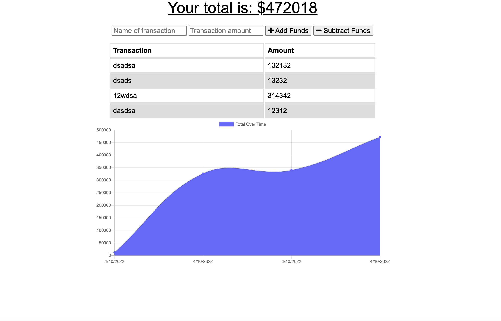

# budget-tracker

## description

This is an app where you can track your budget every day. When you visit it you can add and subtract funds as you with. This website also works offline, and you can download it to your computer. When you subtract and add funds it will show you a chart based off of the funds oyu have been adding and subtracting through the days.

## installation

To install this all you have to do is clone the repository, then run npm i, and finally run npm start and visit your local host on your web browser. You can also visit the website at [Website](https://fathomless-chamber-10803.herokuapp.com/).

## Screenshot

